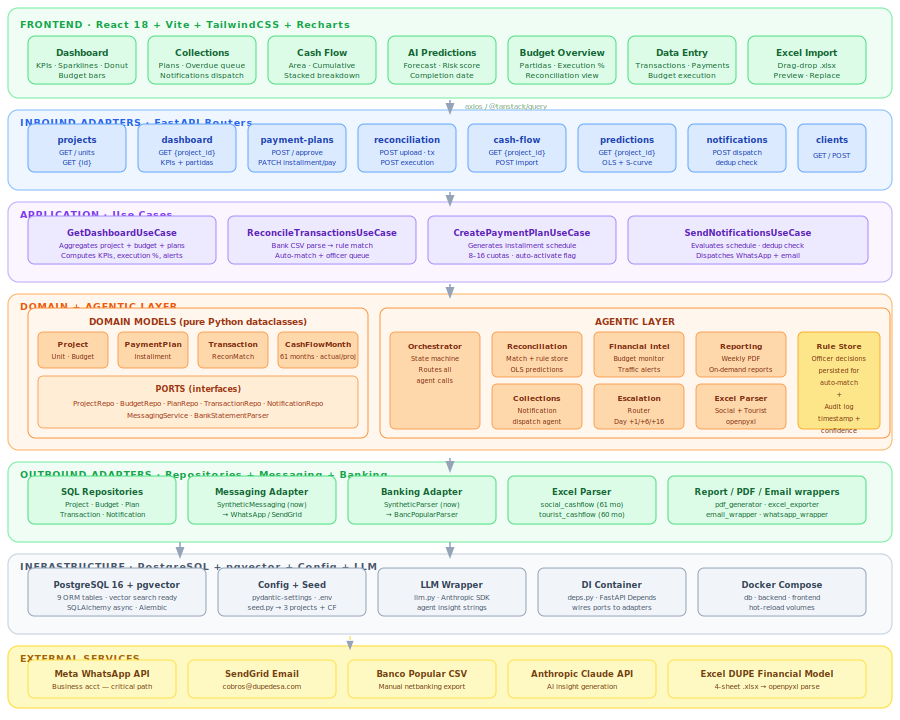

# DUPE Desarrollos Inmobiliarios — Agentic Business Platform L1 Architecture

Version: 0.1  
Date: 2026-06-14  
Status: Initial L1 architecture scaffold. Assumptions marked explicitly throughout.  
Prepared by: HCLTech AI Labs  
Classification: Confidential — Client Proposal

---

## Executive Summary

DUPE Desarrollos Inmobiliarios is a real estate developer in the Dominican Republic managing multi-year residential and tourist projects (24–48 months, 100–480+ units) entirely through manual Excel workbooks and informal processes. There is no integrated financial management system, no automated collections workflow, and no real-time executive visibility into project health.

HCLTech proposes building an **Agentic Business Platform** composed of two integrated modules: a **Financial Management Module** (budget, cash flow, bank reconciliation, accounting, and executive tracking) and a **Collections Management Module** (automated payment plan generation, multi-channel client notifications via WhatsApp and email, delinquency escalation, and portfolio dashboards). The agentic layer sits above both modules — an Orchestrator and four specialist agents handle reconciliation matching, notification scheduling, financial alerting, and report generation autonomously, with human officers validating exceptions and management consuming real-time dashboards.

HCLTech **builds** the agentic orchestration layer, both module backends, and the dashboards. HCLTech **orchestrates** (wraps) the bank statement files, WhatsApp Business API, email delivery service, and document generation service. This is classified as an **MVP Solution** — DUPE requires real client data, an operational system, and a handover for ongoing use; a PoC sandbox alone does not satisfy the engagement.

---

## Working Assumptions

The following assumptions resolve ambiguous answers from the requirements questionnaires. Each is flagged and must be confirmed with DUPE before build scope is finalized.

| # | Assumption | Source of Ambiguity | Impact if Wrong |
|---|---|---|---|
| A1 | Bank statement files are downloadable as CSV or TXT from each bank's netbanking portal. DUPE manually downloads and uploads the file to the system daily. | Questionnaire noted "descarga manual archivo de texto" without specifying format. | If format varies per bank, parser complexity increases; add +1–2 pod days |
| A2 | Dominican Republic tax/invoice standards (not Mexico's CFDI/SAT) apply. No fiscal electronic invoice validation is required for MVP. Invoices are entered manually with reference to a purchase order. | Questionnaire asked about CFDI validation; respondent answered "?" — CFDI is a Mexican standard not applicable in DR. | If DR fiscal integration is required later, add to Pilot scope |
| A3 | A single WhatsApp Business number is used across all projects. Project identity is included in the message template. This is recommended for operational simplicity and cost efficiency. | Questionnaire answered "Según su recomendación." | If per-project numbers are required, licensing and provisioning cost increases |
| A4 | WhatsApp integration uses Meta Cloud API (WhatsApp Business Platform). Twilio is an alternative if Meta verification is delayed. | Questionnaire deferred to HCLTech recommendation. | Provider switch is low-impact at architecture level; same API pattern |
| A5 | Email notifications are sent from a shared domain mailbox (e.g., cobros@dupedesa.com) using SendGrid or equivalent transactional email service, not from individual officer inboxes. | Questionnaire said "correo del oficial asignado." Sending from personal inboxes is operationally fragile and deliverability-risky. | If individual officer email is required, SMTP delegation per officer must be configured |
| A6 | Dual currencies (RD$ and USD$) are supported. Each project is denominated in one primary currency. A manual exchange rate is set by management for cross-currency consolidation reports. No real-time FX feed in MVP. | Questionnaire confirmed RD$ and USD$; no rate-feed question was asked. | If real-time FX rates are required, add FX API wrapper |
| A7 | The chart of accounts (Plan de Cuentas) for accounting will be defined by HCLTech based on standard real estate development practice in the Dominican Republic. Management will review and approve before go-live. | Questionnaire confirmed no existing plan. | If a specific accounting standard is mandated, add SME calibration days |
| A8 | Budget versioning supports two states: Base Budget (locked at project start) and Active Budget (editable). Deviation reports compare Active vs Base. Maximum of 5 budget versions per project. | Questionnaire confirmed versioning needed; did not specify limits. | More versions add complexity to deviation reporting |
| A9 | Physical construction progress (avance físico de obra) tracking in the Seguimiento dashboard is limited to milestone date tracking and % completion entered manually by management. No integration with external project management tools. | Questionnaire confirmed "ambas" (financial and physical) but no source system exists. | If BIM or external PM tool integration is needed, add Pilot scope |
| A10 | Mobile access for management is a responsive web application (mobile-optimized browser experience), not a native iOS/Android app. | Questionnaire said "no para oficial, sí para la visualización de la gerencia." | If native app is required, scope increases significantly |
| A11 | No late fees (mora) or interest on overdue payments in MVP. Delinquency triggers escalation notifications only. | Questionnaire confirmed "No" to mora. | Clear |
| A12 | Partial payments reduce the outstanding balance of the current installment. Overpayments are applied to the next installment automatically. | Questionnaire confirmed this behavior. | Clear |

---

## Problem Statement

| Current Problem | Proposed Agentic Response | Expected MVP Evidence |
|---|---|---|
| Budget and cash flow tracked in disconnected Excel workbooks; no real-time view of projected vs. executed spend | Financial Management Module with Budget Agent monitoring partida execution and alerting on deviations | Dashboard showing live budget vs. executed comparison per partida, with traffic-light status |
| Bank reconciliation is manual: officer downloads statement, manually assigns each transaction to a budget partida | Reconciliation Agent auto-matches bank transactions to partidas using description/amount/date rules; officer reviews only exceptions | 90%+ of transactions auto-matched in demo with real bank file; officer queue shows unmatched items only |
| Collections officers manually track payment due dates and send individual WhatsApp/email messages | Collections Notification Agent schedules and sends pre-due, due-date, and overdue notifications automatically per payment plan | Automated messages delivered for all active payment plans; officer dashboard shows delinquency status without manual tracking |
| No delinquency escalation logic; management learns of overdue accounts informally | Escalation Agent triggers officer dashboard alert at Day +1, management notification at Day +6, and legal referral flag at Day +16 | Full escalation chain visible in management portal for a set of test accounts |
| No automated financial statements; management requests P&L and balance sheet manually | Accounting module auto-generates Balance General, Estado de Resultados, and Flujo de Efectivo per project on demand | All three statements generated and exportable to PDF and Excel from a sample project |
| Weekly management report requires manual compilation from multiple spreadsheets | Reporting Agent compiles and dispatches weekly PDF report automatically on schedule | Scheduled weekly report delivered to management email with correct KPIs |

---

## Implementation Boundary

| Capability | Build or Orchestrate | L1 Treatment |
|---|---|---|
| **Agentic Orchestrator** | Build | Owns workflow state across both modules; routes agent invocations; manages exception queues; handles audit events |
| **Reconciliation Agent** | Build | AI-powered matching of bank transactions to budget partidas; produces match decisions and exception queue |
| **Collections Notification Agent** | Build | Schedules and dispatches WhatsApp and email notifications per payment plan timeline; captures delivery status |
| **Financial Intelligence Agent** | Build | Monitors budget execution vs. projected; generates traffic-light alerts; triggers report generation |
| **Reporting Agent** | Build | Compiles weekly management PDF; generates on-demand financial statements |
| **Bank Statement Parser** (deterministic tool) | Build as controlled tool | Parses CSV/TXT bank file formats into structured transaction objects; no AI decision-making |
| **WhatsApp Business API** (Meta Cloud API) | Orchestrate / wrap | Send and receive messages via API; HCLTech builds the wrapper; Meta provides the channel |
| **Transactional Email Service** (SendGrid or equivalent) | Orchestrate / wrap | Email dispatch via API; DUPE provides domain; HCLTech configures templates |
| **PDF/Excel Generation Service** | Orchestrate / wrap | ReportLab / openpyxl or equivalent library wrapped as a tool; not a third-party SaaS |
| **Financial data store** | Build | PostgreSQL multi-tenant schema: projects, budgets, transactions, accounts, invoices, payment plans |
| **Human review — officer queue** | Orchestrate workflow state | Officers resolve unmatched transactions and delinquency exceptions; their decisions feed back into reconciliation rules |
| **Human review — management approval** | Orchestrate workflow state | Management approves budget versions, acknowledges escalations, reviews reports |

---

## Platform Architecture Diagram

The diagram below shows the full 7-layer hexagonal architecture of the DUPE Agentic Business Platform, from the React frontend down to external services. Each layer communicates only through its adjacent layer — the domain and agentic core has no direct dependency on any framework or database.



| Layer | Technology | Role |
|---|---|---|
| **Frontend** | React 18 · Vite · TailwindCSS · Recharts | 7 pages: Dashboard, Collections, Cash Flow, AI Predictions, Budget, Data Entry, Excel Import |
| **Inbound Adapters** | FastAPI routers | 8 routers exposing REST endpoints; request validation via Pydantic |
| **Application** | Use Cases (pure Python) | GetDashboard · ReconcileTransactions · CreatePaymentPlan · SendNotifications |
| **Domain + Agents** | Python dataclasses + agent classes | Domain models, port interfaces, 5 specialist agents, rule store, audit log |
| **Outbound Adapters** | SQLAlchemy async repos · messaging · banking | Implement domain ports; swappable without touching business logic |
| **Infrastructure** | PostgreSQL 16 + pgvector · Docker Compose | 9 ORM tables, DI container (deps.py), LLM wrapper, seed data |
| **External Services** | Meta WhatsApp · SendGrid · Banco Popular · Anthropic API | Wrapped behind adapter interfaces; none coupled to domain |

---

## Three-Lane Architecture View

### Lane 1: Business Process Flow

**Financial Module**
1. Management creates a project and loads the Estudio de Factibilidad (feasibility study) as the base budget.
2. Budget partidas (income and expense categories) are defined and approved by management.
3. Officers upload the daily bank statement file downloaded from netbanking.
4. Transactions are auto-reconciled to partidas; officer reviews unmatched exceptions.
5. Invoices from suppliers are registered against purchase orders; accounting entries are auto-generated.
6. Cash flow dashboard updates in real time; traffic-light alerts surface partidas approaching or exceeding budget.
7. Management reviews weekly PDF report; financial statements available on demand.

**Collections Module**
1. Sales team registers a new sale (unit, buyer, purchase date, projected delivery date, price).
2. System auto-generates a payment plan (8–16 installments) and management approves.
3. Five days before each installment due date, client receives WhatsApp + email reminder.
4. On and after the due date, officer dashboard shows pending and overdue accounts.
5. At Day +6 overdue, management is notified; at Day +16, legal referral flag is raised.
6. Officer registers payment receipt; system auto-reconciles payment to installment and sends payment confirmation to client.
7. Management views portfolio health dashboard (% cartera sana, tasa de cobro, eficiencia por oficial) updated in real time.

### Lane 2: Agentic Control Layer

| Agent | Purpose | Primary Outputs |
|---|---|---|
| **Agentic Orchestrator** | Owns state machine for both modules; routes events to specialist agents; manages exception queues and audit trail | State transitions, agent invocation schedule, exception routing, audit events |
| **Reconciliation Agent** | Analyzes parsed bank transactions against active budget partidas; scores match confidence; flags exceptions | Match decisions (HIGH/MEDIUM/LOW confidence), exception queue for officer review |
| **Collections Notification Agent** | Reads payment plan schedules daily; determines which notifications are due; dispatches WhatsApp and email; logs delivery status | Sent notifications, delivery receipts, failed delivery alerts, two-way message capture |
| **Financial Intelligence Agent** | Compares executed spend/income vs. projected budget and cash flow; computes deviation metrics; assigns traffic-light status | Dashboard KPIs, partida alerts, deficit forecasts, milestone alerts |
| **Reporting Agent** | Assembles financial statements and weekly management report from structured data; formats and dispatches PDF | Weekly PDF report, Balance General, Estado de Resultados, Flujo de Efectivo |

### Lane 3: Tool / Deterministic Service Layer

| Tool / Service | Purpose |
|---|---|
| **Bank Statement Parser** | Parses uploaded CSV/TXT files from Dominican Republic banks; outputs structured transaction objects (date, amount, reference, description) |
| **WhatsApp Business API Wrapper** | Sends pre-approved template messages; receives inbound messages; reports delivery and read status |
| **Email Dispatch Wrapper** | Sends HTML/text emails via SendGrid; tracks opens, bounces, and delivery failures |
| **PDF Generator** | Renders financial statements and weekly reports to PDF from structured data and templates |
| **Excel Exporter** | Exports budget, cash flow, and statements to XLSX; DUPE-branded template |
| **Audit / Lineage Store** | Logs all agent decisions, notification dispatches, reconciliation matches, and human review actions with timestamps |
| **Rule Store** | Stores reconciliation rules (description pattern → partida mapping) built from officer-accepted matches; improves auto-match rate over time |
| **Notification Schedule Store** | Tracks all payment plan installments and their notification status; prevents duplicate sends |
| **Multi-tenant Data Store** | PostgreSQL: projects, budgets, partidas, transactions, invoices, payment plans, installments, clients |

---

## Programmatic Implementation Pattern

Recommended: LangGraph-style state machine for the agentic orchestration layer. FastAPI backend. React frontend with role-based views (officer, management).

```
FINANCIAL MODULE FLOW:
START
  -> upload_bank_statement
  -> parse_statement (deterministic tool)
  -> reconcile_transactions (Reconciliation Agent)
      -> HIGH confidence: auto-match, update partida execution
      -> LOW confidence / unmatched: create_officer_exception_queue
  -> officer_reviews_exceptions
      -> resolved: update_match_rule_store + update_partida
  -> financial_intelligence_agent_monitors_budget
      -> deviation_detected: create_alert (traffic light update)
  -> reporting_agent_runs_weekly (scheduled)
END

COLLECTIONS MODULE FLOW:
START
  -> register_sale
  -> generate_payment_plan (deterministic)
  -> management_approves_plan
  -> notification_agent_daily_scan
      -> 5 days before due: send_whatsapp + send_email
      -> day of + overdue: update_officer_dashboard
      -> day +6: notify_management
      -> day +16: raise_legal_flag
  -> officer_registers_payment
  -> auto_reconcile_payment_to_installment
  -> generate_send_receipt
END
```

---

## Orchestration States

| State | Description | Exit Criteria |
|---|---|---|
| `project_created` | Project and base budget defined by management | Base budget approved; partidas configured |
| `bank_file_uploaded` | Daily bank statement file uploaded by officer | File parsed successfully into transaction objects |
| `reconciliation_in_progress` | Reconciliation Agent matching transactions | All transactions have a match decision or exception flag |
| `officer_review_pending` | Unmatched/low-confidence transactions in officer queue | Officer resolves all exceptions within 5 business days |
| `partida_execution_updated` | Executed amounts updated in budget | Dashboard reflects current execution vs. projected |
| `alert_triggered` | Financial Intelligence Agent detected deviation or budget overrun | Alert visible in dashboard with traffic-light status |
| `notification_scheduled` | Payment plan installment due within 5 days | Notification queued for dispatch |
| `notification_dispatched` | WhatsApp/email sent to client | Delivery status logged; failures routed to fallback channel |
| `payment_overdue` | Installment not settled by due date | Officer dashboard updated; escalation timer started |
| `escalation_raised` | Day +6 or Day +16 threshold crossed | Management notified; legal flag set if Day +16 |
| `payment_registered` | Officer records client payment | Installment marked settled; receipt generated and sent |
| `report_generated` | Weekly report compiled and dispatched | Management email sent; report available in portal |

---

## Validation Model

| Validation Layer | Role | MVP Treatment |
|---|---|---|
| **Structural** | Bank file has required columns (date, amount, reference, description); payment plan installment counts within 8–16 range | Automated; file rejected with error message if invalid |
| **Reconciliation confidence** | Match score validates that transaction maps to the right partida with acceptable certainty | Automated; LOW confidence goes to officer review queue |
| **Budget guard** | Prevents partida execution from exceeding 110% of approved budget without management override | Automated alert; management must approve override |
| **Notification deduplication** | Ensures the same installment does not receive duplicate notifications in the same window | Automated via notification schedule store |
| **Payment reconciliation** | Verifies registered payment amount matches installment (or handles partial/excess per rules) | Automated; partial balance tracked; excess applied to next installment |
| **Business acceptance** | Management approves budget versions, payment plans, and weekly report delivery | Human in the loop; approval triggers state transition |

---

## High-Level Input / Output Contracts

| Contract | Expected Content | Status |
|---|---|---|
| Bank statement file | CSV or TXT downloaded from DR bank netbanking; contains date, amount (debit/credit), description, reference | Confirmed format (manual download); sample file needed |
| Budget / feasibility study | Excel-based Estudio de Factibilidad (provided); structured as income/expense partidas by month over project life | Sample provided in inputs; needs ingestion mapping |
| Payment plan input | Sale date, delivery date, unit price, % inicial, client data | Captured via sales registration form in system |
| WhatsApp template | Pre-approved template with: client name, unit reference, amount, due date, bank instructions | Template text provided in questionnaire; must be approved by Meta |
| Email template | Plain text; client name, installment amount, outstanding balance, bank transfer instructions | Template provided; domain setup required |
| Weekly management report | PDF: KPIs, budget vs. executed, cash position, portfolio health, collections efficiency by officer | Format to be designed; management review required |
| Financial statements | Balance General, Estado de Resultados, Flujo de Efectivo — per project, filterable by date range | Generated from accounting module; exportable to PDF and Excel |

---

## Conceptual Project Scaffold

```
dupe-agentic-platform/
├── CLAUDE.md
├── README.md
├── docs/
│   ├── architecture/
│   │   └── DUPE_Agentic_Platform_L1_Architecture.md
│   ├── discovery/
│   │   ├── Cuestionario_Finanzas_REV.pdf
│   │   └── Cuestionario_Cobros_REV.pdf
│   ├── rom/
│   │   └── decks/client/
│   └── decisions/
│       └── 0001-engagement-classification.md
├── src/
│   └── dupe_platform/
│       ├── agents/
│       │   ├── orchestrator_agent.py
│       │   ├── reconciliation_agent.py
│       │   ├── collections_notification_agent.py
│       │   ├── financial_intelligence_agent.py
│       │   └── reporting_agent.py
│       ├── integrations/
│       │   ├── bank_statement_parser.py       # CSV/TXT → structured transactions
│       │   ├── whatsapp_wrapper.py            # Meta Cloud API client
│       │   ├── email_wrapper.py               # SendGrid client
│       │   ├── pdf_generator.py               # ReportLab/WeasyPrint
│       │   └── excel_exporter.py              # openpyxl
│       ├── modules/
│       │   ├── finance/
│       │   │   ├── budget.py
│       │   │   ├── cash_flow.py
│       │   │   ├── reconciliation.py
│       │   │   └── accounting.py
│       │   └── collections/
│       │       ├── payment_plans.py
│       │       ├── notifications.py
│       │       └── portfolio.py
│       ├── api/
│       │   ├── routes/
│       │   │   ├── finance.py
│       │   │   ├── collections.py
│       │   │   └── reports.py
│       │   └── middleware/
│       │       ├── auth.py
│       │       └── logging.py
│       └── db/
│           ├── models.py                      # SQLAlchemy multi-tenant schema
│           └── migrations/
├── frontend/
│   ├── src/
│   │   ├── views/
│   │   │   ├── FinanceDashboard.tsx
│   │   │   ├── ReconciliationQueue.tsx
│   │   │   ├── CollectionsDashboard.tsx
│   │   │   ├── PortfolioDashboard.tsx
│   │   │   └── ManagementPortal.tsx
│   │   └── components/
├── configs/
│   ├── reconciliation_rules/                  # Learned partida-matching rules
│   └── notification_templates/                # WhatsApp and email templates
└── tests/
    ├── unit/
    └── fixtures/
        ├── sample_bank_statement.csv
        ├── sample_payment_plan.json
        └── sample_budget.xlsx
```

---

## Architecture Decisions

| Decision | Rationale |
|---|---|
| Single backend serving both modules | DUPE is a small team; two separate deployments add unnecessary operational overhead |
| Rule store for reconciliation learning | Officer-accepted transaction-to-partida matches become rules; auto-match rate improves over time without retraining |
| Meta Cloud API for WhatsApp (not Twilio) | Direct Meta integration is lower cost at scale and avoids intermediary markup; simpler compliance for template pre-approval |
| SendGrid for email (not officer's personal SMTP) | Deliverability, bounce tracking, and template management require a transactional email service (see Assumption A5) |
| PostgreSQL multi-tenant schema | Supports multiple projects with row-level security; scales without separate databases per project |
| Responsive web app, not native mobile | Management mobile access is read-only dashboards; a mobile-optimized React app satisfies this without native app complexity (see Assumption A10) |
| LangGraph orchestration | Provides explicit state machine, deterministic flow control, and clear agent role separation — critical for financial data handling |

---

## Key Risks

| Risk | Likelihood | Impact | Mitigation |
|---|---|---|---|
| Bank statement file format varies across DR banks (BHD, Banco Popular, Scotiabank) | HIGH | MEDIUM | Profile formats for all 3–4 banks DUPE uses before building parser; build configurable format adapters |
| Meta WhatsApp Business Account verification delayed | MEDIUM | HIGH | Start verification process on Day 1 of MVP; use Twilio as standby; MVP cannot demo notifications without an approved WhatsApp number |
| Management does not approve WhatsApp message templates promptly | MEDIUM | HIGH | Draft templates on Day 1; Meta requires 24–72 hours for template approval; delays block notification demo |
| Chart of accounts definition takes longer than expected (no existing catalog) | MEDIUM | MEDIUM | HCLTech proposes a standard DR real estate CoA; management reviews and signs off in Week 1 |
| Reconciliation match rate is low on first run (ambiguous bank descriptions) | MEDIUM | MEDIUM | Train rule store on 30 days of historical transactions before go-live; set officer expectation that first month has higher manual review load |
| Physical construction progress requires integration with external PM tool | LOW | MEDIUM | Scoped to manual % entry in MVP per Assumption A9; revisit in Pilot |
| Dual-currency reporting requires FX rate management | MEDIUM | LOW | Manual exchange rate entry by management in MVP is acceptable; automate in Pilot |

---

## Open Questions for DUPE Confirmation

1. What is the exact bank statement file format (column headers, delimiter) for each bank DUPE uses? Can a sample file be provided?
2. Should budget partida hierarchy be configurable per project, or is one global hierarchy template used with project-level additions?
3. How should multi-project consolidation reports work — total company view across all active projects, or project-by-project only?
4. At Day +16 overdue, "externar a la firma de abogados" — does the system need to send an automatic notification to the law firm, or is this a manual action triggered by management after seeing the flag?
5. Should the system support DUPE's planned second project type (Turístico in USD) from day one, or scope MVP to one project type and expand in Pilot?
6. Who manages the WhatsApp Business Account and Meta developer account — DUPE IT, a contracted agency, or HCLTech?
7. Is there a target go-live date or deadline that constrains the MVP timeline?

---

## MVP Candidate Scope

- One active project (either social interest or tourist type)
- Budget module: base + active budget, partida tree, deviation dashboard
- Reconciliation: bank file upload, auto-match, officer exception queue, rule store
- Accounting: manual invoice entry, auto journal entries, Balance General and Estado de Resultados
- Collections: payment plan for 20–30 active clients, WhatsApp + email notifications, officer and management dashboards
- Weekly PDF report (one template)
- Role-based access: officer (read + limited write) and management (full access)
- Responsive web app (no native mobile in MVP)
- Dual-currency support with manual FX rate

**Out of scope for MVP:**
- Full multi-project consolidation reporting
- Native mobile app
- Real-time FX rate feed
- BIM / external PM tool integration for physical progress
- Legal firm API integration
- Second project type (Turístico) — add in Pilot unless client confirms Day 1 priority
